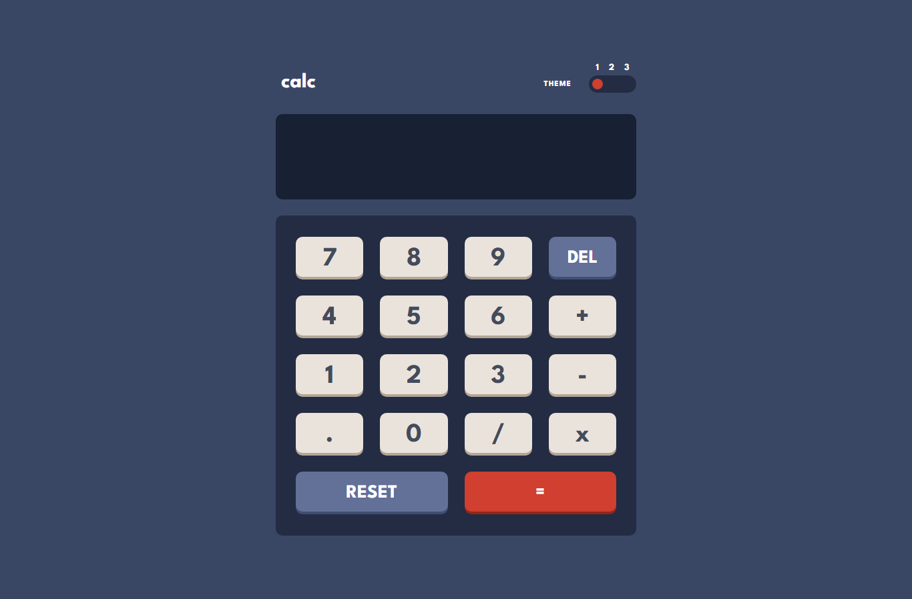
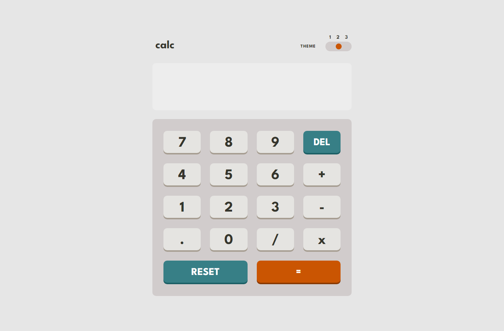
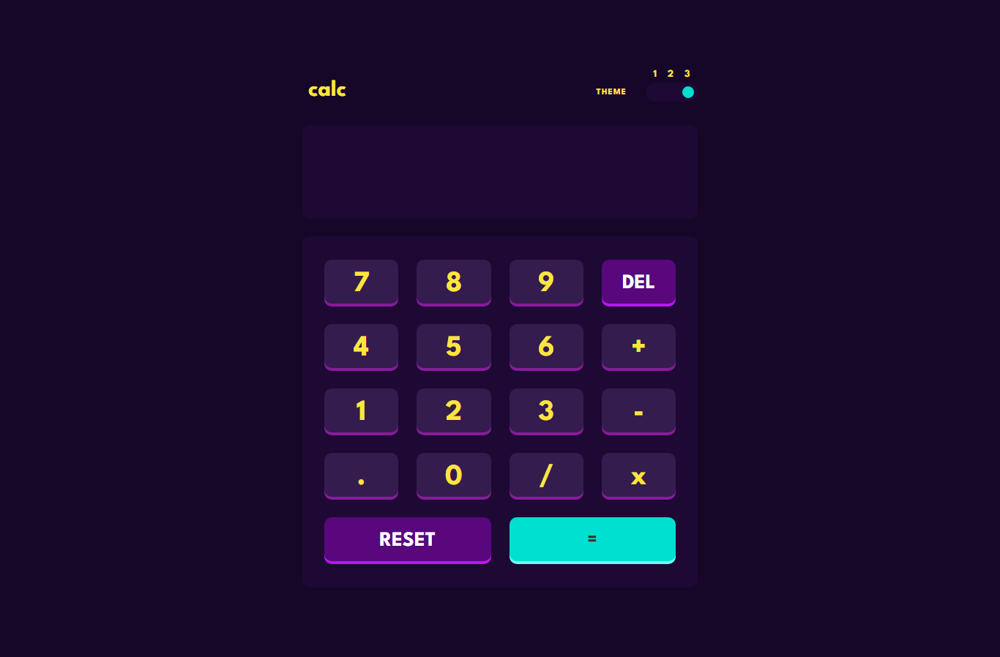
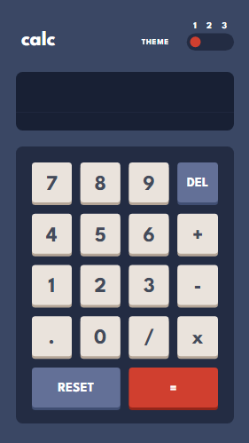
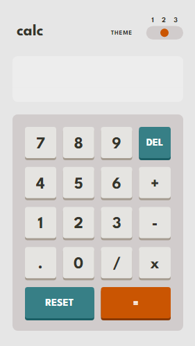
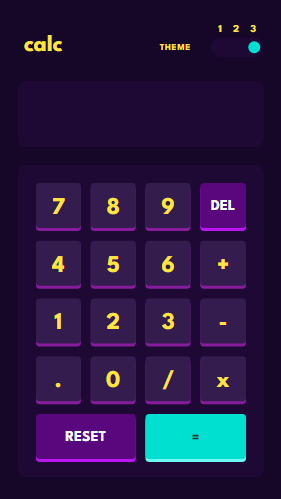

# Frontend - Calculator

## Table of contents

- [Overview](#overview)
  - [The challenge](#the-challenge)
  - [Screenshot](#screenshot)
  - [Links](#links)
- [My process](#my-process)
  - [Built with](#built-with)
  - [Continued development](#continued-development)
- [Author](#author)

## Overview
In search for resources to better my front-end Journey, I discovered an amazing site that provides front-end developers with design files to replicate. This is one of the many solutions I have submitted so far. Do give me your feedbacks on how I can improve.

### The challenge

Users should be able to:

- See the size of the elements adjust based on their device's screen size
- Perform mathmatical operations like addition, subtraction, multiplication, and division
- Adjust the color theme based on their preference
- **Bonus**: Have their initial theme preference checked using `prefers-color-scheme` and have any additional changes saved in the browser

### Screenshot

### Links
- Live Site URL: [Calculator App](https://calculator-six-gamma-44.vercel.app/)

### Built with

- Semantic HTML5 markup
- CSS custom properties
- CSS Grid
- CSS Media Queries
- Plain JavaScript

### Continued development

In future projects, I want to be able to combine my HTML and CSS knowledge with JavaScript to be able to build a flexible, responsive, functional and interactive websites, landing pages, blogs and a Portfolio for myself.

## Author

- Github - [Mohit Kumar](https://github.com/Relax-29)
- LinkedIn - [Mohit Kumar](https://www.linkedin.com/in/rerelax/)

